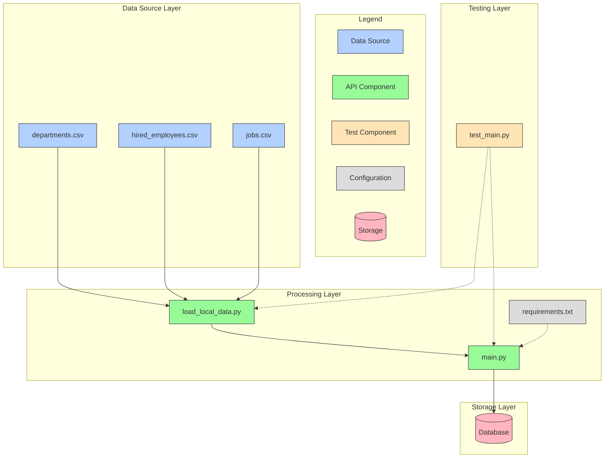

# data_eng_project
A data engineer project that load a csv database backup, using a API to control the load of the files.

```mermaid
graph TB
    %% Style Definitions
    classDef source fill:#b3d1ff,stroke:#333
    classDef api fill:#98FB98,stroke:#333
    classDef test fill:#FFE4B5,stroke:#333
    classDef config fill:#DCDCDC,stroke:#333
    classDef storage fill:#FFB6C1,stroke:#333

    %% Legend
    subgraph Legend
        S1[Data Source]:::source
        A1[API Component]:::api
        T1[Test Component]:::test
        C1[Configuration]:::config
        DB1[(Storage)]:::storage
    end

    %% Data Source Layer
    subgraph DataSources["Data Source Layer"]
        CSV1[departments.csv]:::source
        CSV2[hired_employees.csv]:::source
        CSV3[jobs.csv]:::source
    end

    %% Processing Layer
    subgraph ProcessingLayer["Processing Layer"]
        LoadData[load_local_data.py]:::api
        MainAPI[main.py]:::api
        Config[requirements.txt]:::config
    end

    %% Testing Layer
    subgraph TestLayer["Testing Layer"]
        TestMain[test_main.py]:::test
    end

    %% Storage Layer
    subgraph StorageLayer["Storage Layer"]
        DB[(Database)]:::storage
    end

    %% Relationships
    CSV1 --> LoadData
    CSV2 --> LoadData
    CSV3 --> LoadData
    LoadData --> MainAPI
    MainAPI --> DB
    TestMain -.-> MainAPI
    TestMain -.-> LoadData
    Config -.-> MainAPI

    %% Click Events
    click CSV1 "https://github.com/luchoss10/data_eng_project/blob/main/upload_files/departments.csv"
    click CSV2 "https://github.com/luchoss10/data_eng_project/blob/main/upload_files/hired_employees.csv"
    click CSV3 "https://github.com/luchoss10/data_eng_project/blob/main/upload_files/jobs.csv"
    click LoadData "https://github.com/luchoss10/data_eng_project/blob/main/load_local_data.py"
    click MainAPI "https://github.com/luchoss10/data_eng_project/blob/main/main.py"
    click TestMain "https://github.com/luchoss10/data_eng_project/blob/main/test_main.py"
    click Config "https://github.com/luchoss10/data_eng_project/blob/main/requirements.txt"
```
